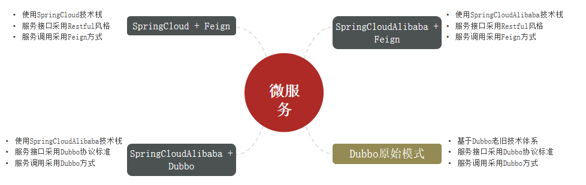
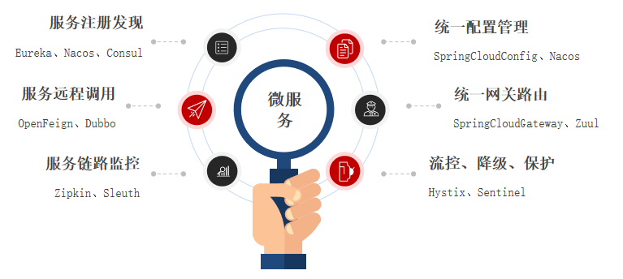

## 微服务基础知识

##### 单体架构：将业务的所有功能集中在一个项目中开发，打成一个包部署。

优点：
- 架构简单
- 部署成本低

缺点：
- 耦合度高

##### 分布式架构：根据业务功能对系统进行拆分，每个业务模块作为独立项目开发，称为一个服务。
  
优点：
- 降低服务耦合
- 有利于服务升级拓展

缺点：
- 架构非常复杂，运维、监控、部署难度提高

SpringCloud 是目前国内使用最广泛的微服务框架。

官网地址：[SpringCloud](https://spring.io/projects/spring-cloud)

SpringCloud集成了各种微服务功能组件，并基于SpringBoot实现了这些组件的自动装配，从而提供了良好的开箱即用体验：

注：SpringCloud与SpringBoot的版本还存在兼容关系

##### 服务拆分：
1. 单一职责：不同微服务，不要重复开发相同业务
2. 数据独立：不要访问其它微服务的数据库
3. 面向服务：将自己的业务暴露为接口，供其它微服务调用

