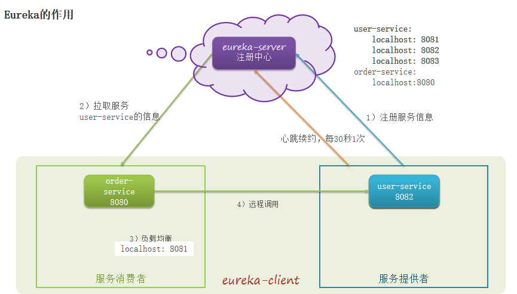
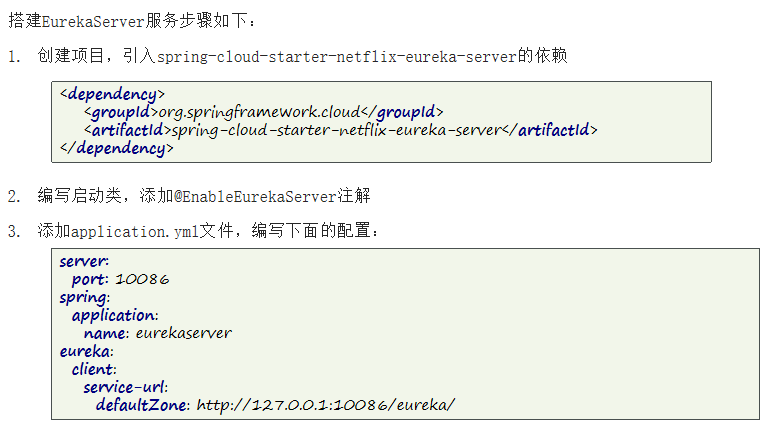
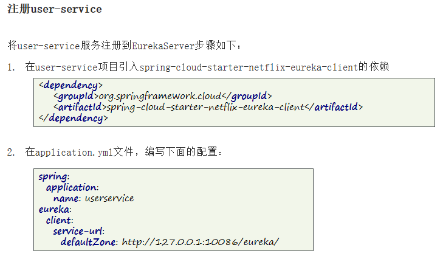
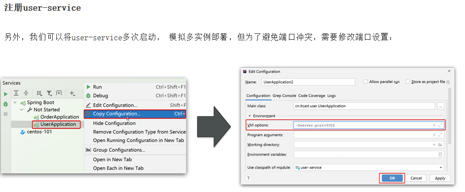
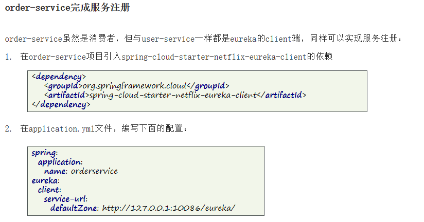

## Eureka 注册中心

#### 远程调用的问题
##### 服务消费者该如何获取服务提供者的地址信息？

1. 服务提供者启动时向eureka**注册**提供者的信息 
2. eureka**保存**信息
3. 消费者根据服务名称向eureka**拉取**提供者信息

##### 如果有多个服务提供者，消费者该如何选择？

服务消费者利用**负载均衡**(轮询)算法，从服务列表中挑选一个

##### 消费者如何得知服务提供者的健康状态？

1. 服务**提供者**会每隔**30秒**向EurekaServer**发送心跳请求**，报告健康状态
2. eureka会更新记录服务列表信息，心跳不正常会被**剔除**
3. 消费者就可以拉取到最新的信息

#### 搭建EurekaServer

搭建EurekaServer
- 引入eureka-server依赖
- 添加@EnableEurekaServer注解
- 在application.yml中配置eureka地址

#### 服务注册

1. 引入eureka-client依赖 
2. 在application.yml中配置eureka地址 
3. 无论是消费者还是提供者，引入eureka-client依赖、知道eureka地址后，都可以完成服务注册

#### 服务发现
服务拉取是基于**服务名称**获取服务列表，然后在对服务列表做负载均衡

1. 搭建EurekaServer
- 引入eureka-server依赖
- 添加@EnableEurekaServer注解 
- 在application.yml中配置eureka地址

2. 服务注册
- 引入eureka-client依赖
- 在application.yml中配置eureka地址

3. 服务发现
- 引入eureka-client依赖
- 在application.yml中配置eureka地址
- 给RestTemplate添加@LoadBalanced注解
- 用服务提供者的服务名称远程调用

