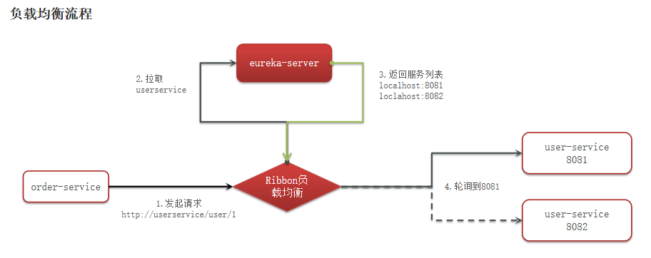
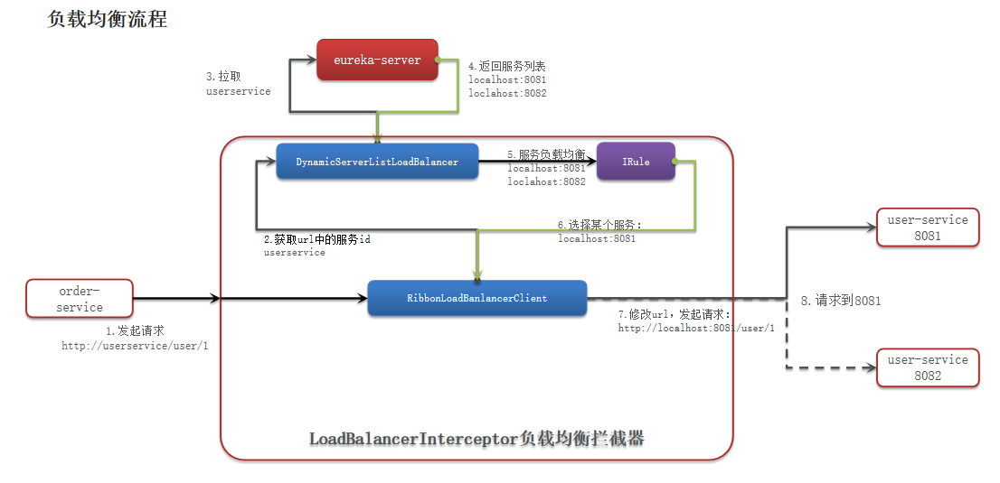
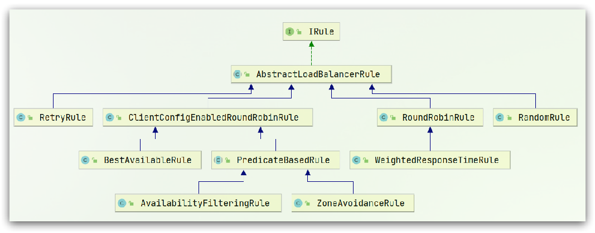
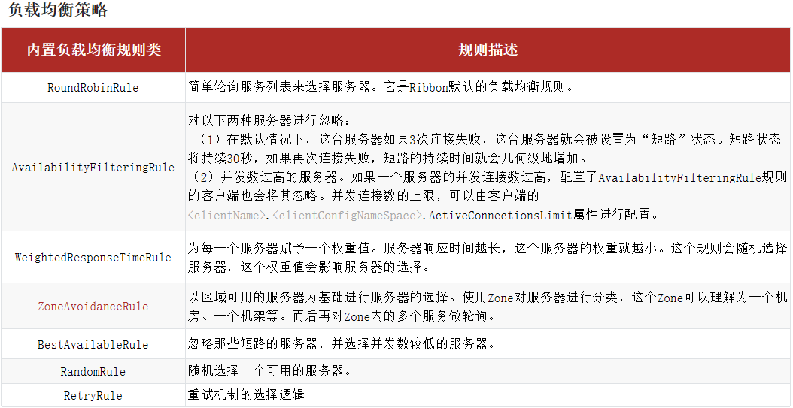

## Ribbon 负载均衡



### 负载均衡原理



### 负载均衡策略

Ribbon的负载均衡规则是一个叫做**IRule**的接口来定义的，每一个子接口都是一种规则：



规则接口是IRule

默认实现是**ZoneAvoidanceRule**，根据zone选择服务列表，然后轮询



通过定义IRule实现可以修改负载均衡规则，有两种方式：
1. 代码方式：在order-service中的OrderApplication类中，定义一个新的IRule：
   代码方式：配置灵活，但修改时需要重新打包发布

```java
@Bean
public IRule randomRule(){
    return new RandomRule();
}
```
2. 配置文件方式：在order-service的application.yml文件中，添加新的配置也可以修改规则：
   配置方式：直观，方便，无需重新打包发布，但是无法做全局配置

```java
userservice:
        ribbon:
        NFLoadBalancerRuleClassName: com.netflix.loadbalancer.RandomRule# 负载均衡规则
```


### 懒加载

Ribbon默认是采用懒加载，即第一次访问时才会去创建LoadBalanceClient，请求时间会很长。 

而饥饿加载则会在项目启动时创建，降低第一次访问的耗时，通过下面配置开启饥饿加载：

开启饥饿加载

指定饥饿加载的微服务名称

```java
ribbon:
        eager-load:
        enabled: true # 开启饥饿加载
        clients: userservice # 指定对userservice这个服务饥饿加载
```
