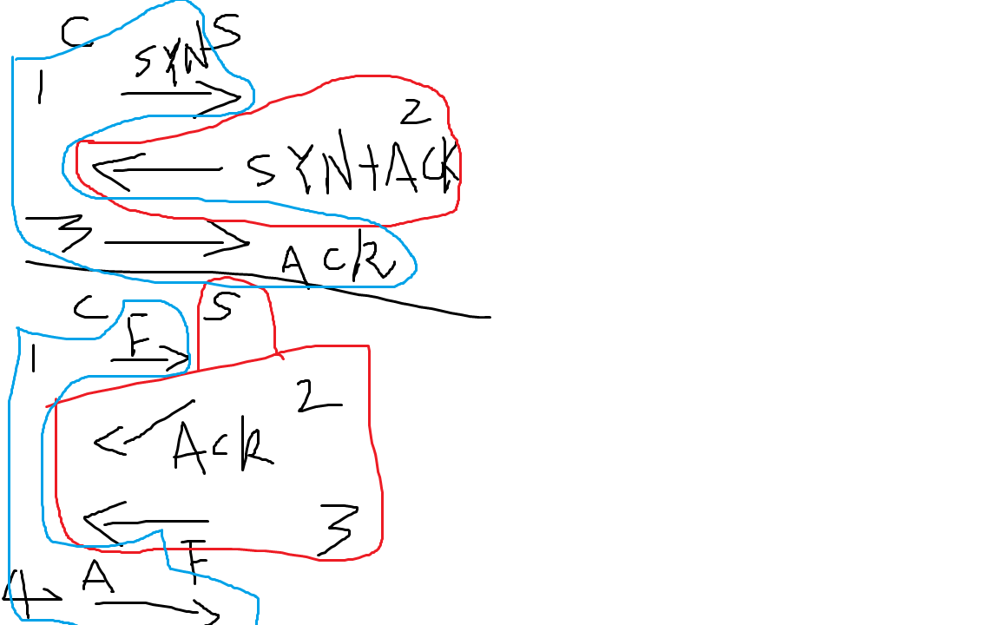
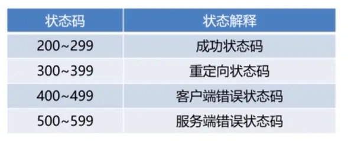
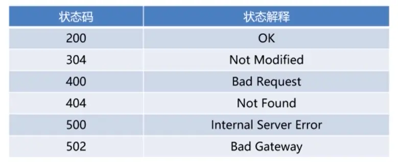

应用层：HTTP协议

传输层：TCP，UDP协议

网络层：IP协议，ARP

数据链路层：以太网协议，MAC地址

物理层：光缆，电缆，双绞线，无线电波，（把数据链路层发过来的数据转换成电信号）

## TCP协议-传输层

传输控制协议，定义***数据传输和连接方式***的规范

TCP协议是面向**字节流**的协议，不管传输什么数据，都需要转成字节，再传输

#### TCP应用场景

(1). 微信、QQ等APP消息发送接收

(2). 浏览器-服务器通信

(3). 其他可靠通信的场景

#### 三次握手建立连接

1. 当**客户端**向**服务端**发起连接时，会发一包连接请求数据，过去询问一下，能否与你建立连接，这包数据称为**SYN**包

2. 如果**服务端**同意连接，则回复一包**SYN+ACK**包

3. 客户端收到后回复一包**ACK**包，连接建立，因为这个过程中互相发送了**三包数据**，所以称之为“三次握手”。

为什么不是三次握手而不是两次握手？

这是为了防止因为已失效的请求报文，突然又传到服务器引起错误。

三次握手之后，客户端和服务器端都进入到了传递数据的状态。

#### 四次挥手终止连接

1. **客户端**向**服务端**发送**FIN**包 (结束标志)

2. 服务端**收到**FIN包后，向客户端发送**ACK**包 (确认编号)

3. 服务端**再**向客户端**发送FIN**包

4. 客户端收到FIN包，**向服务端**发送**ACK**包

`SYN`😦`Synchronize Sequence Numbers`，同步序列编号)
`ACK`😦`Acknowledgement Number`，确认编号)
`FIN`:结束标志

### TCP vs UDP

TCP传输数据**稳定可靠**，适用于对网络通讯质量要求较高的场景，需要准确无误的传输给对方，比如传输网络，发送邮件，浏览网页，传送消息等

UDP的优点是速度快，但是可能产生**丢包**，所以适用于对实时性要求较高，但是对少量丢包没有太大要求的场景，比如域名查询，语音通话，视频直播等。UDP还有一个非常重要的应用场景，就是隧道网络，比如**VPN**，以及在SDN中用到的VXLAN

------

## HTTP-应用层

超文本传输协议，包含着超链接，图片，视频等多媒体的副本，定义***传输数据的内容***的规范

#### HTTP请求方法：

1. GET:  获取指定的服务器资源
2. POST: 提交数据到服务端
3. DELETE: 删除指定的服务器端资源
4. UPDATE: 更新指定的服务端资源

### 常见的HTTP状态码

