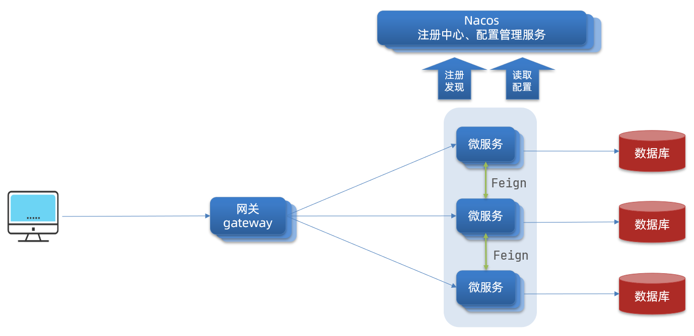
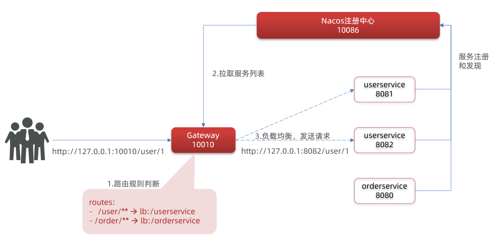
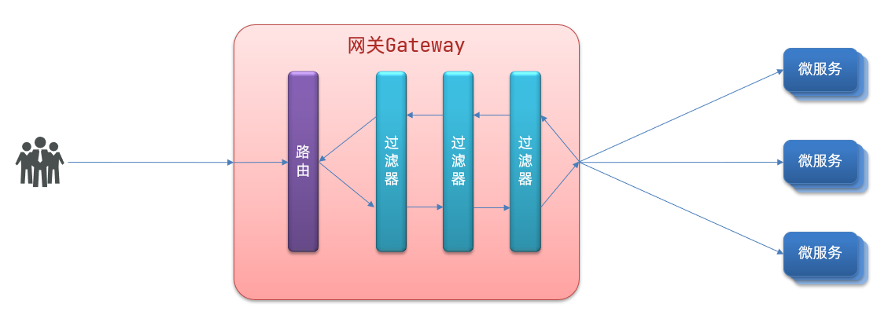

# Spring Cloud Gateway 
为微服务架构提供一种简单有效的统一的 API 路由管理方式。

网关的**核心功能特性**：
- 请求路由
- 权限控制
- 限流



**权限控制**：网关作为微服务入口，需要校验用户是是否有请求资格，如果没有则进行拦截。

**路由和负载均衡**：一切请求都必须先经过gateway，但网关不处理业务，而是根据某种**规则**，把**请求转发**到某个微服务，这个过程叫做路由。当然路由的目标服务有多个时，还需要做负载均衡。

**限流**：当请求流量过高时，在网关中按照下流的微服务能够接受的速度来放行请求，避免服务压力过大。

### 网关路由的流程图



#### 总结：
网关搭建步骤：
1. 创建项目，引入nacos服务发现和gateway依赖
```java
<!--网关-->
        <dependency>
            <groupId>org.springframework.cloud</groupId>
            <artifactId>spring-cloud-starter-gateway</artifactId>
        </dependency>
        <!--nacos服务发现依赖-->
        <dependency>
            <groupId>com.alibaba.cloud</groupId>
            <artifactId>spring-cloud-starter-alibaba-nacos-discovery</artifactId>
        </dependency>
```
2. 配置application.yml，包括服务基本信息、nacos地址、路由
```java
server:
  port: 10010 # 网关端口
spring:
  application:
    name: gateway # 服务名称
  cloud:
    nacos:
      server-addr: localhost:8848 # nacos地址
    gateway:
      routes: # 网关路由配置
        - id: user-service # 路由id，自定义，只要唯一即可
          # uri: http://127.0.0.1:8081  # 路由的目标地址 http就是固定地址
          uri: lb://userservice       # 路由的目标地址 lb就是负载均衡，后面跟服务名称
          predicates:             # 路由断言，也就是判断请求是否符合路由规则的条件
            - Path=/user/**     # 这个是按照路径匹配，只要以/user/开头就符合要求
```

#### 路由配置包括： 
1. 路由id：路由的唯一标示
2. 路由目标（uri）：路由的目标地址，http代表固定地址，lb代表根据服务名负载均衡
3. 路由断言（predicates）：判断路由的规则，
4. 路由过滤器（filters）：对请求或响应做处理

### 过滤器工厂
GatewayFilter是网关中提供的一种过滤器，可以对进入**网关的请求和微服务**返回的响应做处理：


